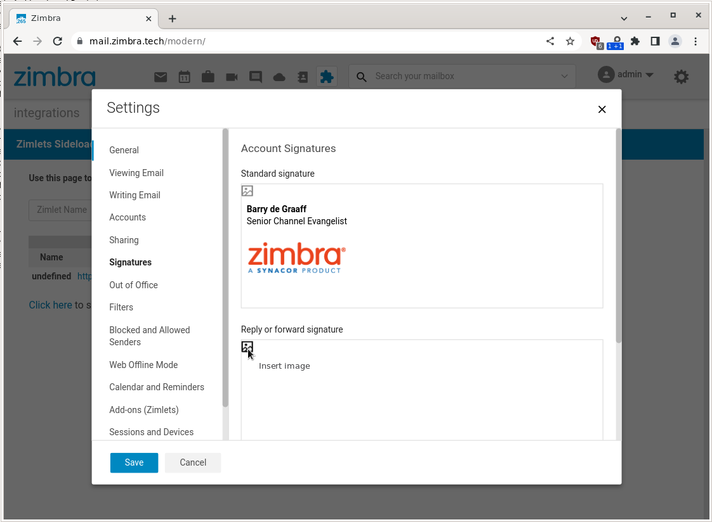

# Signature Attachment Zimlet

This Zimlet adds a button in the compose field in Settings->Signatures which allows the user to add images in email signatures.

## HTML Signature exceeds maximum length of 10,240

See: https://wiki.zimbra.com/wiki/HTML_Signature_exceeds_maximum_length_of_10,240
Example to disable limit on default CoS: zmprov mc default zimbraMailSignatureMaxLength 0

## Screenshots

